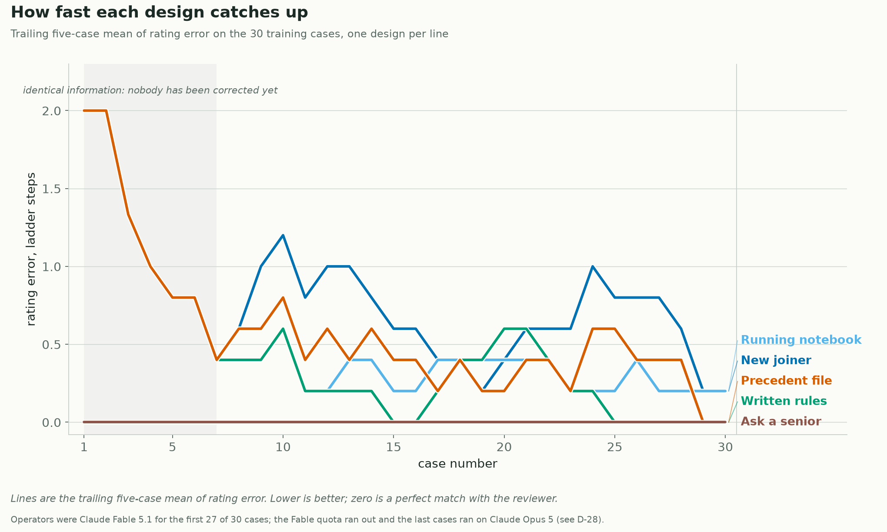

# Loop engineering experiments

Seven runnable experiments in **loop engineering**: the design of the loop *around* an agent. Who tells it that it was wrong, how much it is told, what it is allowed to keep afterwards, and what it gets handed the next time similar work arrives. Same model, same task, same feedback in every arm; only the loop differs.

Everything is built on **LangGraph** with a SQLite checkpointer, uses **synthetic data only**, and is scored by deterministic code against answers frozen by hash before any agent starts.



## The headline experiment: the underwriting apprentice

One job repeated thirty-eight times. Rate a life insurance application. Thirty training files with a senior's markup after each, then eight held-out files with memory frozen and no feedback. Every decision is answered by a **fresh model instance with no conversation history**, so nothing can be remembered except through the design's own memory.

Four designs, identical except for what each holds when it opens a file and what it keeps when the file is done:

| Design | Has when opening the file | Keeps when the file is done |
|---|---|---|
| `new_joiner` | The manual, nothing else | Nothing. Every file is day one |
| `notebook` | Plus every past markup, word for word | Appends the markup as written |
| `written_rules` | Plus a rule book it wrote itself | A second model call rewrites the book |
| `precedent` | Plus the three nearest past files and their answers | Files this case with its answer |

The agent is given a 900-word starter manual containing every rating table. **Twelve house rules are never shown to anyone**, each learnable only from being corrected on it.

**Result** (average deviation from the actual rating, in rating classes; lower is better):

| Design | 30 training files | 8 held-out files | Held-out exactly right |
|---|---|---|---|
| New joiner | 0.67 | 0.88 | 2 of 8 |
| Running notebook | 0.40 | 0.25 | 6 of 8 |
| Written rules | 0.33 | 0.25 | 6 of 8 |
| Precedent file | 0.47 | 0.38 | 5 of 8 |

Two of the eight held-out files turn on a rule that appears in **no** training file. All four designs missed both. That is the ceiling: a learning loop captures only what its feedback has actually covered.

Two checks were registered before the run and both passed: the four designs must be a dead heat over the first seven files, where they hold identical information, and performance on files the manual fully covers must not change with experience.

Read the write-up: **[articles/underwriting-apprentice/article.md](articles/underwriting-apprentice/article.md)**

## Honest framing

- **Synthetic data only.** Nothing here is medical, actuarial, underwriting, pricing, fraud, legal or regulatory evidence. The underwriting manual and its house rules are invented for the experiment.
- **External memory, not training.** The "learning" is Markdown files and JSONL logs retrieved into the agent's context. No model weights change.
- **No API key is used.** In `manual` mode the graph pauses on a LangGraph `interrupt()` at each decision and a stateless subagent answers one JSON request file. See [Reproducing](docs/REPRODUCING.md) for how to wire your own provider instead.
- **One run per design.** The ordering is the finding; the exact decimals are not. There are no error bars.
- **A model change mid-run.** `uw_001` began on Claude Fable 5.1 and the quota was exhausted with 37 of 258 calls outstanding, so `written_rules` and `ask_senior` finished on Claude Opus 5. Every case record stores the model that produced it, so the results can be split by model straight from the logs. See decision **D-28**.

## Quick start

Requires Python 3.12 or 3.13 and [uv](https://docs.astral.sh/uv/).

```bash
git clone https://github.com/pbhat89/loop-engineering-experiments.git
cd loop-engineering-experiments
uv sync --extra dev

# 1. confirm the frozen underwriting data matches the code that generates it
uv run python -m src.underwriting.data verify

# 2. run all four designs end to end with deterministic stub operators, no model calls
uv run python -m src.underwriting.run --run-id uw_demo --condition notebook --phase train --mode stub

# 3. the test suite (314 tests)
uv run pytest
```

Nothing above calls a model. To run the real thing, see the guide below.

## Reproducing

**[docs/REPRODUCING.md](docs/REPRODUCING.md)** is the step-by-step: the file protocol the runner speaks, how to drive it with Claude Code subagents on a subscription, how to point it at an API provider instead, roughly what it costs, and how to check your results against the ones committed here.

The short version: the runner pauses and writes a request file, you answer it with one fresh stateless agent, the runner resumes. Any model that can read a JSON file and write one back can play the operator.

## What is in the repository

```
src/underwriting/    experiment 7: rating engine, case generator, scorer, memories, graph, runner
src/                 experiments 1-6: the claims-analysis graph, evaluator, skill store and validator
data/underwriting/   the frozen pack: starter manual, 14 house rules, 38 files, answers, hashes
config/              experiment configuration; every knob that was varied
goldens/             frozen answer keys for the claims tasks
scripts/             summarisers, archiver, leakage audit, verification
artifacts/uw/uw_001/ the live run in this README: 258 request/response pairs and per-file logs
archive/             every earlier run, complete with its logs
docs/                design decisions, the decision log, the operator protocol, reproduction
articles/            two Substack-ready articles with their figure pipelines
tests/               314 tests, including a leakage audit over every request file
```

**Where to start reading:** [docs/decision-log.md](docs/decision-log.md) records every design decision and why, including the ones that went wrong. [docs/underwriting-apprentice-design.md](docs/underwriting-apprentice-design.md) is the pre-registration, written and committed before any code. [docs/OPERATOR_PROTOCOL.md](docs/OPERATOR_PROTOCOL.md) is the contract between the runner and whatever answers it.

## The earlier experiments

Six experiments on a synthetic healthcare claims dataset came first. They are kept in full because the negative results are the useful part.

| # | What it tested | Outcome |
|---|---|---|
| 1 | Briefs that state the conventions | Ceiling. Every arm scored full marks first try, so nothing was ever learned. Null result |
| 2 | A deterministic rule learner, no model | Skills arm ahead on first attempts, but every task converged after one retry |
| 3 | Blinded briefs, capped feedback, five attempts | A skills arm passed four tasks in 8 attempts against 10 with no memory. Self-review declared everything done and failed three of four |
| 4 | Five arms including a raw-log memory | Raw log beat a curated skill library: 11 attempts against 13, and half the first-try failures |
| 5 | Held-out transfer with memory frozen | Warm arms passed 2 of 3 first try against 0 of 3 cold. Memory transfers conventions, not competence |
| 6 | Removing the skill-proposal gate | Negative. Ungated rules were written too narrowly and scored like no memory at all |

The lesson that produced experiment 7: **a learning curve needs the same job repeated.** Six different tasks give six one-shot trials, not a curve.

Article: [articles/loop-engineering-markdown-skills/article.md](articles/loop-engineering-markdown-skills/article.md)

## Licence

Code, docs, figures and the underwriting data are MIT. The claims experiments reference a CC BY-NC 4.0 dataset that is not redistributed here; values derived from it stay under that licence. See [LICENSE](LICENSE).
