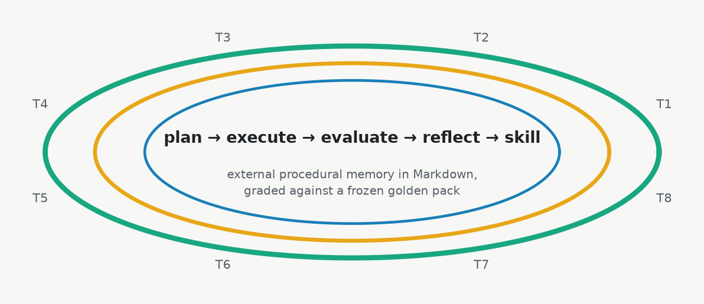
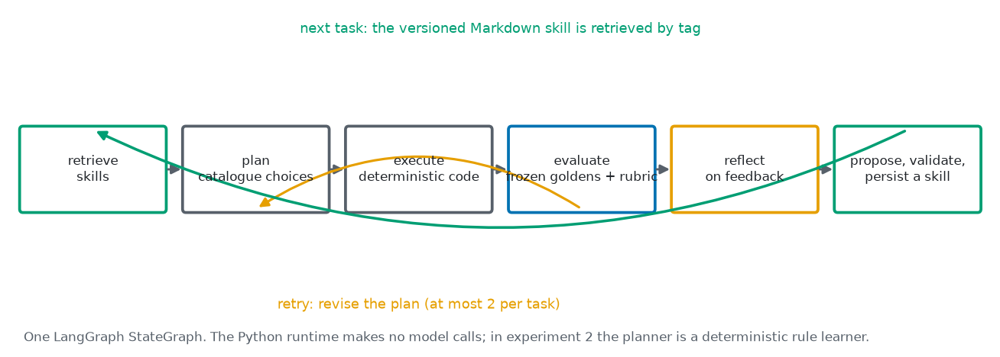
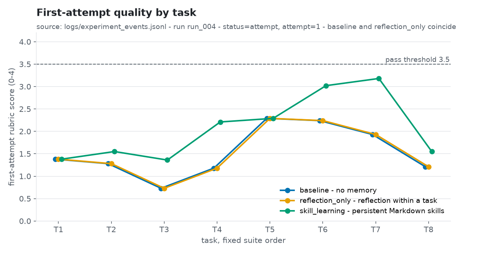
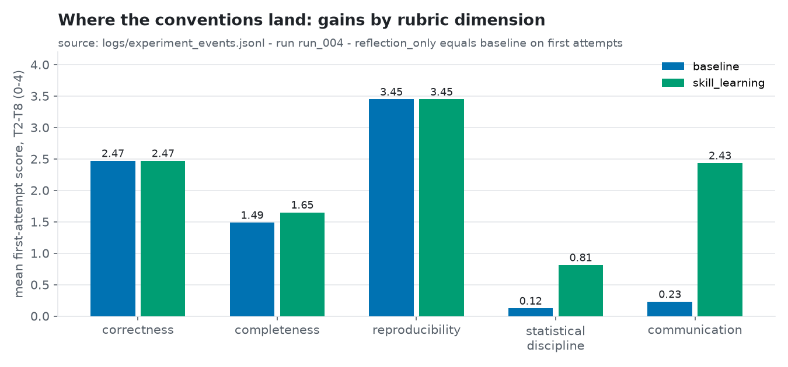
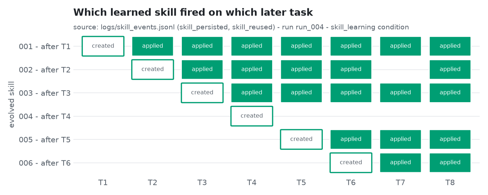

<!--
Title: Loop engineering, take two: teaching an agent house conventions with Markdown skills
Subtitle: A weekend experiment with LangGraph, a frozen golden pack and a deliberately naive planner — and what the failed first attempt taught me
Tags: LangGraph, Agentic AI, Loop Engineering, Evaluation, Synthetic Data, MLOps
Photo credits:
  - assets/hero_loop.png — "Image by Author" (matplotlib). Swap for an Unsplash hero if you prefer a photo; a search for "loop staircase" or "spiral" fits the theme.
  - assets/loop_diagram.png — "Image by Author" (matplotlib)
  - assets/first_attempt_by_task.png — "Image by Author" (matplotlib, from logs/experiment_events.jsonl, run_004)
  - assets/dimension_gains.png — "Image by Author" (matplotlib, from logs/experiment_events.jsonl, run_004)
  - assets/skill_reuse_matrix.png — "Image by Author" (matplotlib, from logs/skill_events.jsonl, run_004)
-->

# Loop engineering, take two: teaching an agent house conventions with Markdown skills

*A weekend experiment with LangGraph, a frozen golden pack and a deliberately naive planner — and what the failed first attempt taught me*


*Image by Author*

Every second agent demo now claims the agent "gets better over time". Press on that claim and it usually dissolves into one of two things: a longer prompt that somebody edited by hand, or a vector store of past chats that nobody has ever measured. Neither is learning in any sense an underwriter would accept on a Monday morning.

I wanted to test one specific, unglamorous version of the idea — **external procedural memory**. The agent does a task, gets graded against a reference that was frozen before it started, reflects on what the grader said, writes the reusable part down as a versioned Markdown "skill", and retrieves that skill on the next task. No weights change. No fine-tuning. Just a loop, a memory folder, and an evaluator that cannot be argued with.

This example is built for self-learning, on a fully synthetic healthcare claims dataset. The remarks below are my personal take basis building and running it twice; there is no branding or promotion involved, and I am not advocating for any framework. The first attempt failed in an instructive way, so I am writing up both.

## What am I actually testing?

A brief primer, because three of these terms get used loosely:

- **Loop engineering.** Designing the plan → execute → evaluate → reflect → retry cycle as an explicit, inspectable graph, rather than hoping one long prompt does the right thing. The intelligence of the model matters less than the shape of the loop around it.
- **Procedural memory as skills.** A skill here is a Markdown file with a fixed schema (trigger, objective, numbered procedure, required checks, provenance). It records *how* to do something, never a finding. Skills are immutable once written; a new lesson becomes a new version.
- **Golden pack.** Before any comparison runs, deterministic reference code computes the expected metrics, artifacts and safeguards for each task — denial rate with its numerator and denominator, the exact high-cost threshold from the training split, which features are forbidden — and the whole pack is hashed and frozen. The agent is measured against that, not against its own opinion of its output.

And the classic trade-off, stated up front: memory that transfers between tasks is exactly the thing that can contaminate a comparison. If the planner remembers, the "no memory" baseline is not a baseline. Everything about the design below follows from taking that seriously.

## How does the loop look?


*Image by Author*

The build is a single LangGraph `StateGraph` with twelve nodes. Three experimental conditions run the same eight claims-analysis tasks — data reconnaissance, portfolio description, provider patterns, denial analysis, fraud exploration, a fraud model, a high-cost model and an executive brief — in a fixed order:

1. **baseline** — plan, execute, evaluate, revise on failure. Nothing crosses from one task to the next.
2. **reflection_only** — the same, plus an explicit reflection step before each revision. Still nothing crosses tasks.
3. **skill_learning** — plus retrieve skills before planning, and after each task reflect → propose a skill → validate it → persist it. A skill written after task *n* can only be retrieved from task *n + 1*.

A few choices I would defend to anyone:

- **The planner does not write code.** It selects components and parameters from a fixed catalogue per task (which denominator, which date column, which features, which caveats). Deterministic pandas and scikit-learn code executes the plan. That keeps the loop safe and makes every decision comparable across conditions.
- **The evaluator is deterministic and blind to the model.** 152 rubric checks across five dimensions (correctness, completeness, reproducibility, statistical discipline, communication), scored 0–4, compared to the frozen goldens — exact values, tolerances, file existence, leakage exclusions, caveat text. No LLM judge. Where a check fails, the feedback carries the exact fix.
- **Stopping rules.** Pass → stop immediately. At most two retries per task. A skill is proposed only if the lesson applies to at least two remaining tasks, and every skill must cite the feedback it was learned from.
- **Interrupts and checkpoints.** Each LLM-decision node pauses the graph on a LangGraph `interrupt()`, with a SQLite checkpointer, so a run survives across processes and every decision leaves a request/response file behind.

Everything the loop does is logged as JSONL: every attempt, node transition, feedback item, skill proposal, validation, retrieval and reuse. The charts in this article are generated from those logs and nothing else.

## Take one: why a strong planner learned nothing

For the first run the planner was Claude (Fable 5.1), invoked as a fresh, stateless subagent for every single decision — 37 of them — inside my Claude Code session, with no API calls from the Python side. Stateless on purpose: an operator with a conversation history would carry lessons across tasks and quietly break the baseline.

Result: every condition passed every task on the first attempt at 4.00 out of 4.00. Zero retries. Zero evaluator feedback. And because the validator requires an evolved skill to cite the feedback it was learned from, all five skill proposals were rejected for missing provenance. Zero skills persisted.

That is a clean null, and the reason is not subtle in hindsight. The task briefs stated the house conventions ("report the denial rate with its numerator and denominator"; "define high cost as the top 5 % of paid amount on the training split") and a Fable-class model reading a fair brief simply does the right thing. A loop that learns from failure needs failure. The harness, goldens and evaluator all worked; the experimental design gave them nothing to do.

> A self-improving loop cannot improve on a planner that never needs to.

One more thing surfaced later, and I am including it because it is the kind of bug that quietly flatters a result. The caveat check looked for the word "baseline" as evidence of a *model limitations* caveat — and the baseline condition's own reports mention their condition name in the header. The baseline got a free point on one check. The fix (match keywords only inside caveat sections, strip run ids, condition names and paths) is what makes baseline and reflection_only land on identical first-attempt scores in the run below, which is the sanity check I now run first.

## Take two: a planner that starts ignorant

If the conventions are the thing to be learned, the planner must not know them. So the second run swaps the LLM for something deliberately dumb: a **rule learner** that starts every task from the catalogue's textbook defaults (all-claims denominators, adjudication date for trends, no small-group flag, preprocessing fitted on all rows, a leaky default feature list, no caveats) and changes a choice only when either the evaluator's feedback on the current task says so, or a retrieved skill carries a convention it can apply.

Conventions are written into the skill as tokens, generalised **by parameter name** — which is exactly what a house convention is:

```python
# src/rule_learner.py — the whole "language" the learner reads and writes
COMPONENT_RULE = re.compile(r"component:([a-z][a-z0-9_]*)")               # include component <id>
PARAM_RULE = re.compile(r"param:(?:([a-z][a-z0-9_]*)\.)?([a-z][a-z0-9_]*)=([A-Za-z0-9_.\-]+)")  # param:<name>=<value>
LIST_RULE = re.compile(r"list:([a-z][a-z0-9_]*)(\+=|-=)(\S+)")            # list:<name>+=<value> / -=<value>

# a param rule fires on *every* selected component that has that parameter:
# "any `denominator` means adjudicated_claims", "any `min_group_size` is 30"
```

A skill it wrote after task 2 (abridged) looks like this — provenance is the list of feedback ids, not prose:

```markdown
---
skill_id: evolved_run_004_002
kind: evolved
created_after_task: T2
source_feedback_ids: [T2-denial_rate_value, T2-denial_rate_denominator, T2-monthly_date_column, T2-show_denominators, ...]
tags: [descriptive, rates, denominators, financial, trends, communication, ...]
---
## Required checks
- component:denial_rate
- param:denominator=adjudicated_claims
- component:monthly_trend
- param:date_column=service_date_from
- param:show_denominators=true
- list:caveats+=descriptive_only
```

Everything else stayed frozen: the same suite, rubric, goldens and hash, the same three conditions, the same stopping rules. Retrieval is tag overlap, top 8. The whole run takes about two minutes and zero model tokens:

```bash
uv run python -m src.run_experiment run-auto --run-id run_004 --mode rule_learner
uv run python scripts/summarize_run.py --run-id run_004
```

## What happened?


*Image by Author*

The line to read is the first-attempt score — the quality of the plan *before* the evaluator has said anything about this task. Baseline and reflection_only coincide exactly (as they must; neither carries anything between tasks). The skill-learning condition starts identical on T1 and sits above on six of the seven later tasks:

| condition | mean first attempt, T1–T8 | mean, T2–T8 |
|---|---:|---:|
| baseline | 1.53 | 1.55 |
| reflection_only | 1.53 | 1.55 |
| skill_learning | 2.07 | 2.17 |


*Image by Author*

Where the gain lands is the interesting part. Statistical discipline moves from 0.12 to 0.81 and communication from 0.23 to 2.43 — denominators stated, small groups flagged, leakage exclusions applied, caveats and citations present. Correctness does not move at all (2.47 → 2.47). Conventions transfer; task-specific *scope* — which segments to break down, which sources to cite, which features belong to this target — does not, because there is no convention to learn there.

Two honest non-results sit next to that:

- **Nobody passed first time.** Every task in every condition still needed exactly one revision (the feedback carries the exact fix, so the second attempt always passes). Skills raised where a first attempt *starts*; T6 and T7 reached 3.02 and 3.18 against a pass threshold of 3.5, but the retry count stayed at one per task. If your definition of reliability is fewer retries, this run does not deliver it yet.
- **Reflection without memory is worth nothing here.** reflection_only costs eight more operator steps than baseline and changes no outcome — the reflection is thrown away with the task.

## Which skills earned their keep?


*Image by Author*

Six skills were proposed, six validated, six persisted — one after each of T1–T6. Five of them were retrieved and applied on later tasks (7, 5, 5, 3 and 2 times). One never was: the skill learned after the denial-analysis task encodes that task's segment list and nothing else, so it is exactly the "growing folder of Markdown" the brief warned about, and it gets reported as such.

The most instructive event is a case of over-generalisation. The skill learned after the fraud-exploration task correctly says "compare on these permitted features — `allowed_amount`, `paid_amount`, service units, …" and "never use `fraud_pattern_type`". On the high-cost task, amount fields *are* the target, so the same convention is leakage. The rule learner applied it anyway (it generalises by parameter name, not by meaning), the first attempt failed on exactly that check — at 3.18 rather than baseline's 1.93, because everything else it had learned still helped — and the task's own feedback corrected it. A convention learned on one task can be wrong on the next; the loop absorbs that through the same feedback path it learns from. I find that more reassuring than a run where nothing ever went wrong.

## Food for thought

> **Evaluator blindness.** The "baseline" keyword bug cost nothing this time, but it would have inflated the baseline in a noisier experiment. Symmetry between the two no-memory conditions on first attempts is now the first thing I check, and I would recommend it as a standing assertion in any loop-engineering harness.

> **Conventions versus scope.** A rule learner can carry conventions across tasks; it cannot infer that "the segments for a denial analysis" means something different from "the segments for a provider analysis". That is where a language model would actually earn its place in the loop — as the thing that decides *which* remembered lesson applies, not as the thing that remembers.

> **When would an LLM planner show this?** Take one says: not when the briefs give the conventions away. The obvious next runs are a weaker or lower-effort planner with blinded briefs, or tasks whose correct procedure is a genuinely local convention. The harness is ready for either; the frozen pack does not change.

> **Cost.** The LLM run took 37 subagent steps and most of an afternoon (and a rate-limit reset). The rule-learner run takes two minutes and is reproducible bit for bit. There is a version of this experiment for every budget, and the cheap one told me more.

## Learnings and future enhancement areas

- Freeze the target before the agent runs. The golden pack turned a vague "did it get better?" into a table I can defend, and made the null result of the first run unambiguous rather than embarrassing.
- Statelessness is not optional. One fresh operator per decision was the only way to keep the baseline honest with an LLM in the loop; the rule learner gets it for free.
- Provenance rules bite in both directions. Requiring skills to cite feedback ids blocked five ungrounded proposals in run one — correct — and made every proposal in run two traceable to the checks that triggered it.
- Skills should be conventions, not scopes. Encoding "any denominator means adjudicated claims" transferred; encoding "the five segments of T4" did not. A validator that scored proposals for *transferability* (how many parameter names they touch versus how many literal values) would prune the bloat case before it is written.
- Next: blinded briefs with a small model as operator; a `foundational_only` control (already built, not yet run) to separate "having a curated library" from "learning new skills"; and a second golden pack on a different dataset to see whether the learned conventions survive a change of shop.

Synthetic data, one deterministic run per condition, illustrative throughout — nothing here is evidence for any real claims process.

## References

1. LangGraph documentation — persistence, checkpointers and human-in-the-loop `interrupt()`: https://langchain-ai.github.io/langgraph/
2. HLT-008 Synthetic Healthcare Claims Dataset (sample preview), CC BY-NC 4.0: https://huggingface.co/datasets/xpertsystems/hlt008-sample
3. scikit-learn `train_test_split` (the split convention shared by the golden builder and the executor): https://scikit-learn.org/stable/modules/generated/sklearn.model_selection.train_test_split.html
4. The experiment's own records — `docs/writeup.md`, `docs/decision-log.md` (D-18, D-19), `logs/*.jsonl` and `archive/experiment-1_run_001/` in the repository.

The full repository (code, frozen golden pack, logs, both write-ups and every skill the learner wrote) sits alongside this article; the experiment's own write-up is `docs/writeup.md`.

**Read this article online:** https://claude.ai/code/artifact/541293ef-bde3-4a40-95ff-11449a825aee
