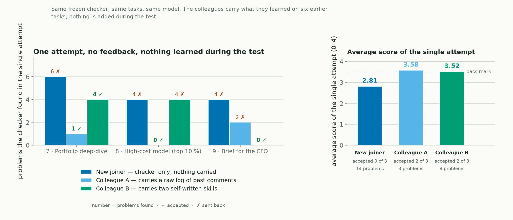

<!--
Title: Loop engineering: five analysts, one reviewer, and what carries over
Subtitle: A weekend LangGraph experiment in designing the loop around an agent — and why the loop matters more than the model inside it
Tags: Loop Engineering, Agentic AI, LangGraph, Self-Improvement, Evaluation, Synthetic Data
Photo credits:
  - assets/hero.png — "Image by Author" (matplotlib). Swap for an Unsplash photo if you prefer; "spiral staircase" fits the theme.
  - assets/loop_diagram.png — "Image by Author" (matplotlib)
  - assets/results_grid.png — "Image by Author" (matplotlib, from logs/experiment_events.jsonl and logs/skill_events.jsonl, run_006 + run_008)
  - assets/oneshot_test.png — "Image by Author" (matplotlib, first attempts of the held-out test run_008)
-->

# Loop engineering: five analysts, one reviewer, and what carries over

*A weekend LangGraph experiment in designing the loop around an agent — and why the loop matters more than the model inside it*

*Image by Author*

Most agent demos that claim to "get better over time" turn out to be one of two things: a prompt somebody kept editing, or a vector store of old chats nobody has measured. I wanted to look at the mechanism instead. An agent does a piece of work, something tells it what went wrong, it tries again, and something is kept for next time. Every clause in that sentence is a design choice: *what* tells it, *how much* it is told, *what* is kept, and *who* decides when it is done. Making those choices deliberately is what people now call loop engineering.

To test it I needed work where someone can be perfectly competent and still wrong in ways that only show up on inspection. Analysing an unfamiliar dataset is exactly that. You pick up its nuances as you go — which rows count, which date column means what, which field quietly leaks the answer into your model — you make mistakes you cannot see yourself, and sometimes you simply do not know what this place does in a given situation. I used a synthetic healthcare claims dataset because I know that kind of data. The domain is the example, not the point.

So picture five claims data analysts starting on the same Monday.

## Five analysts, one reviewer

All five are equally capable and none of them has seen this data before. Each gets the same six pieces of work, one after another. A reviewer checks each finished piece against an answer key and sends back **the three biggest problems** — what is wrong, never which button to press. What separates the five is only this: who tells them they are wrong, and what they still have in hand when the next task lands.

| The analyst | How they work | In loop terms | Where the idea comes from |
|---|---|---|---|
| **Forgets everything** | Reads the reviewer's comments, fixes the piece in front of her, starts every new task from a blank page | Checker only | the basic verification loop |
| **Keeps a notebook** | Same, but every comment the reviewer ever made goes into a notebook verbatim, and she skims all of it before starting anything new | Checker + raw log | a searchable log of past review comments |
| **Writes the house rules** | Same, but whenever a piece is accepted she distils what she learned into a short titled procedure and files it, then pulls up the ones that match later | Checker + skills | skill libraries: Voyager, ExpeL, Reflexion |
| **Has no reviewer** | Checks his own work and decides for himself when it is good enough | Self-review only | Self-Refine (Madaan et al., 2023) |
| **No reviewer, but takes notes** | Same, plus a notebook of his own past verdicts | Self-review + raw log | the cell nobody publishes |

The last two still get scored by the reviewer for the record; they just never see the score. That is the point of having them.

Underneath, all five are the same LangGraph state graph with a SQLite checkpointer, and every decision is answered by a fresh Claude Haiku 4.5 subagent inside my Claude Code session — no API key, and deliberately no memory of previous steps. If the model remembered on its own, "forgets everything" would not mean anything.

> The model is the least interesting part. The loop is the product.

## What was the work?

Six tasks on the same claims dataset, in a fixed order, phrased the way a business sponsor would phrase them, with none of the house conventions spelled out. The right-hand column is what the reviewer holds and nobody ever sees.

| # | The task | What a correct answer looks like |
|---|---|---|
| 1 | **Data check.** Five files arrived. What is in them, can the identifiers be trusted, what period do they cover, do they join? | Row counts of all five tables (members 500 … medical claims 12,845 … pharmacy claims 18,310). Every natural key tested, including the composite key on the adherence table. 36 claims adjudicated before their service ended. Pharmacy claims join to nothing in the provider directory. |
| 2 | **Describe the book.** Volume by status, denial rate, fraud-flag rate, amounts, monthly trend. | Denial rate **1,286 / 12,339 = 10.4 %** over adjudicated claims (506 pended claims excluded; 1,286 / 12,845 is wrong). Monthly trend keyed on when care started, not when the claim was decided. Every rate shown with its denominator. |
| 3 | **Where denials happen.** Top denial codes, claims with no code, denial rate by five segments. | Code shares over *denied* claims. 11,559 claims carry no code, none of them denied. Segments under 30 claims flagged as unstable. |
| 4 | **Providers and network.** Where money and denials go by specialty and network; the ten busiest providers. | Specialty and network reported as separate breakdowns. In-network 10.6 % vs out-of-network 9.7 %. The join to the provider directory verified before it is trusted. Differences described as associations. |
| 5 | **High-cost model.** When a claim arrives, will it end in the most expensive 5 %? | Threshold **$3,198.99 from the training split only**. Billed and allowed amounts are not allowed as features (the target is derived from paid amount). ROC-AUC between 0.60 and 0.95; 0.997 means the answer leaked in. |
| 6 | **Executive brief.** One page for the sponsor, built only from the saved results above. | At most 600 words, the required sections, every number cited to a saved result, no causal wording. |

That column is a *golden pack*: 112 checks computed by independent reference code, reviewed, and frozen by hash before anyone started. Work is scored 0 to 4; accepted means 3.5 or better with no critical miss. Three further tasks, numbered 7 to 9, were held back for a test at the end.

## How the loop is built

*Image by Author*

Four steps and a memory:

1. **Plan.** The analyst reads the brief and picks a method from a fixed menu per task — which denominator, which date column, which features, which caveats. No code is written, which keeps the loop safe and every decision comparable between analysts.
2. **Run.** Deterministic pandas and scikit-learn code executes the plan and produces the tables, charts and a short report.
3. **Check.** The frozen reviewer scores the output and returns the three biggest problems, plus a count of how many more there are.
4. **Reflect and revise.** The analyst reads the findings, revises the plan, and the work runs again. Up to five tries per task.

The memory is the only thing that crosses from one task to the next, and it is the thing I varied. The notebook is the cheapest version imaginable: append the comments, show them all next time, no summarising, no filtering. The house rules are the expensive version: after a piece is accepted the analyst decides whether the lesson generalises, writes it in a fixed format, a validator checks it is not a duplicate or a one-off restatement, and it is retrieved later only when its trigger matches the new task.

## How did the six tasks go?

*Image by Author*

| Analyst | Attempts to get all six accepted | Problems found on first tries | Tasks accepted |
|---|---|---|---|
| Forgets everything | 14 | 39 | 6 / 6 |
| Keeps a notebook | 11 | 20 | 6 / 6 |
| Writes the house rules | 13 | 28 | 6 / 6 |
| Has no reviewer | 10, stopped by his own verdict | 29 | **1 / 6** |
| No reviewer, but takes notes | 12, stopped by his own verdict | 39 | **1 / 6** |

**The loop actually iterates.** With three findings at a time and no fix attached, the forgetful analyst needed two or three tries on every task. Task 4 went 1.35 → 3.11 → 3.87: the first plan lumped specialty and network into one breakdown, the reviewer said so, the second plan fixed that and exposed the next layer. That staircase is what a verification loop is supposed to look like, and it only appears if the feedback names problems rather than handing over the answer.

**The notebook was the best memory here.** Eleven attempts instead of fourteen, and half the first-try problems. On task 4 the notebook analyst was accepted first time with nine past comments in front of her, several about denominators and small segments from tasks 2 and 3, which is exactly what task 4 needed. Nothing clever happened. She read what the reviewer had said before and did not repeat it.

**House rules helped where a rule applied, and cost more to earn.** Two rules got written: add the synthetic-data caveat to reports, after task 1, and use adjudicated claims as the denial-rate denominator, after task 2. Both were cited on all four later tasks, and task 3 was accepted first time because of the second one. But writing, validating and revising rules took 31 operator steps against 16 for the notebook, and two of six tasks still needed three tries. Distillation is not free, and a library of two rules cannot cover much.

**Marking your own homework is not review.** Both no-reviewer analysts declared every task done; the reviewer accepted one of six from each. On the executive brief one of them did something instructive: his first attempt would actually have been accepted at 3.64, he asked himself for a revision anyway, and the revision scored 3.38. Without an external reference the loop cannot tell improvement from drift.

**Giving the self-reviewer a notebook made things worse, not better.** Thirty-nine first-try problems against twenty-nine. A log of your own past opinions is a log of your own blind spots.

One caveat over all of it: this is one run with a model that is not deterministic. On task 1, before any memory existed, the three reviewed analysts started at 3.02, 3.20 and 3.20. Part of every gap is the luck of the first plan. The direction is credible; the size is not.

## Now a new joiner walks in

The six tasks above are where the memory was built, so they cannot tell you whether it transfers. For that I held three tasks back and changed the rules: **one attempt each, no feedback, and nothing learned along the way.** Memories are frozen for the test, so what you see is what each analyst walked in knowing.

And here is the thing about the analyst who forgets everything: she never stops being a new joiner. Six tasks of corrections have left her with nothing. So the held-out test is the most ordinary situation in any team — a new starter and two experienced colleagues, handed the same three pieces of work on the same morning.

The three tasks are deliberately dense in the conventions the earlier work taught, and they ask different questions: a fuller description of the book (status mix, denial rate, fraud flag, how the amounts are distributed, monthly volume and spend); an early-warning model for the most expensive 10 % of claims instead of 5 %; and a one-page brief for the CFO built from those two results. On the menu's default settings these tasks score between 1.2 and 1.7, and with the conventions applied they score 4.0, so there is real room for experience to show. To be sure no answers travelled inside the memories, every number in the notebook was replaced by a placeholder and an audit compared what was left against every value in the new answer keys. It caught one: the adjudicated-claims denominator count from task 2, which the first held-out task would have reused.

*Image by Author*

| The single attempt on tasks 7 to 9 | New joiner | Colleague with a notebook | Colleague with house rules |
|---|---|---|---|
| Accepted by the reviewer | **0 of 3** | 2 of 3 | 2 of 3 |
| Problems the reviewer found | 14 | 3 | 8 |
| Average score (accepted at 3.5) | 2.81 | 3.58 | 3.52 |

The new joiner's work came back on all three, with the classic mistakes: the wrong denial-rate denominator and the wrong month on the book, leaked amount fields and an implausible AUC on the model, causal wording and missing sections on the brief. The colleague with the notebook made almost none of them and was sent back once, on the brief, for causal wording — which no comment in her notebook had ever mentioned, because during the six tasks she had been corrected on citations and sources instead. The colleague with the house rules applied her denominator rule on the book and her caveat rule on the brief, and had nothing at all about leakage, so she failed the model task exactly like the new joiner.

Acceptance is the score plus no critical miss, not a count of problems, which is why the house-rules colleague got through task 7 with four light problems and was sent back from task 8 with four heavy ones.

That last failure is the most useful thing in the whole experiment, because it was my fault rather than the loop's. I had written a rule saying an analyst may only file a house rule if it applies to at least two of the *remaining* tasks. The modelling lessons were learned on task 5, when only task 6 was left, so they were never written down. The notebook had no such gate, kept those same comments automatically, and that is precisely why it sailed through the held-out model task. Whatever filter you put on "what is worth writing down" decides what transfers, and a filter keyed to this week's queue is the wrong one.

So: **memory transfers conventions, not competence.** It removes the mistakes you have already been corrected on, and it cannot remove any others. A first held-out set I built before this one used tasks a cold start could nearly pass anyway and showed almost no gap; it is archived with its numbers, because a test has to be hard enough for experience to matter.

## What I take from it

- **Put the reviewer outside the loop.** The cheapest design to build is the one that produces confident, wrong work. If the thing being improved also decides when it is good enough, you have a demo, not a control.
- **Feedback that names problems, not fixes, is what makes learning visible.** An earlier version of this experiment handed back the full checklist with the fixes attached; everything converged in one retry and taught the loop nothing that a good error message would not.
- **Start with the dumb memory.** A plain notebook of past comments beat self-written rules on the six tasks and edged them on the held-out test. Distilled rules are the right long-term structure — a notebook capped at thirty comments is already choosing what to forget, and retrieval by trigger scales where "show everything" does not — but the distillation step has to earn its keep, and the filter you distil through decides what survives.
- **Judge memory by what it stops you repeating.** The experienced colleagues did not know more than the new joiner. They made fewer of the mistakes they had already been corrected on. That is the honest expectation, and the right thing to measure.

## Food for thought

> **Who writes the reviewer?** In this experiment the same person wrote the answer key and blinded the briefs — me. In a real team the reviewer encodes whoever's conventions won the last argument. That is not a flaw of the loop; it is the loop making an implicit standard explicit, which is uncomfortable and useful in equal measure.

> **When does memory stop being an asset?** Two rules are a notebook. Forty rules, half of them near-duplicates, is a retrieval problem and a source of confidently misapplied advice. What to keep, merge or retire is a governance question, and I have not seen a clean answer to it.

## Learnings and next steps

- The feedback regime is a design parameter, not plumbing. Three findings, fix withheld, five attempts: those numbers decide whether you are watching a loop or a lookup.
- Blinding matters more than model size. A much stronger model reading briefs that stated the conventions passed everything first time and learned nothing. A small model with blinded briefs produced all of the behaviour above.
- One run per design is a demonstration, not evidence. Next: several seeds per design, a longer sequence so distilled rules have more to earn, and a retirement rule for memory that stops being cited.
- Synthetic data throughout. Nothing here says anything about any real payer, provider or member. It says something about how to build the loop.

## References

1. Madaan et al., *Self-Refine: Iterative Refinement with Self-Feedback* (2023) — https://arxiv.org/abs/2303.17651
2. Shinn et al., *Reflexion: Language Agents with Verbal Reinforcement Learning* (2023) — https://arxiv.org/abs/2303.11366
3. Wang et al., *Voyager: An Open-Ended Embodied Agent with Large Language Models* (2023) — https://arxiv.org/abs/2305.16291
4. Zhao et al., *ExpeL: LLM Agents Are Experiential Learners* (2023) — https://arxiv.org/abs/2308.10144
5. LangChain, *The Art of Loop Engineering* — https://www.langchain.com/blog/the-art-of-loop-engineering
6. Lilian Weng, *Harness Engineering for Self-Improvement* (2026) — https://lilianweng.github.io/posts/2026-07-04-harness/
7. LangGraph documentation, human-in-the-loop interrupts and checkpointers — https://docs.langchain.com/oss/python/langgraph/overview
8. HLT-008 Synthetic Healthcare Claims Dataset (sample), `xpertsystems/hlt008-sample` on Hugging Face, CC BY-NC 4.0 — https://huggingface.co/datasets/xpertsystems/hlt008-sample

The code, the frozen answer keys, all 134 operator requests and responses across the six tasks and the held-out test, the memory logs with their redaction audit, the written rules and the logs behind every figure are in the `claims-skill-loop` repository (branch `feat/claims-skill-loop`, runs `run_006` and `run_008`; the superseded first held-out attempt is `run_007` in the archive). This article is also online at https://claude.ai/code/artifact/541293ef-bde3-4a40-95ff-11449a825aee.
