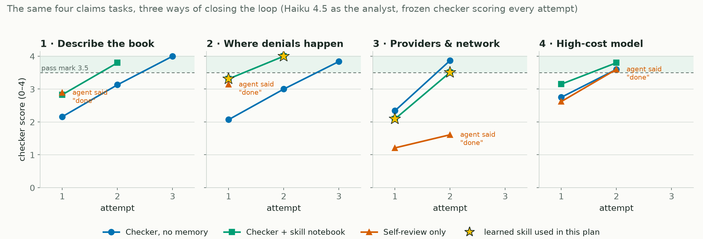
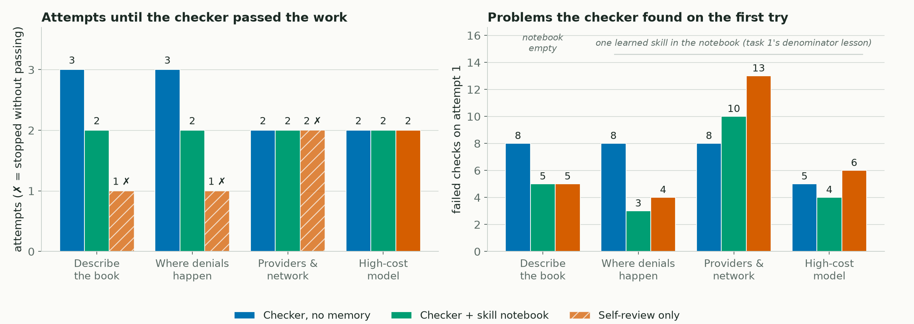
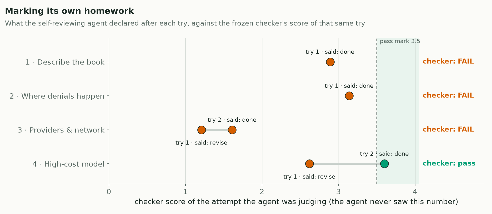

<!--
Title: Teaching a claims analyst agent the house rules
Subtitle: A weekend LangGraph experiment: four claims questions, one frozen answer key, and three ways of closing the loop
Tags: Agentic AI, LangGraph, Claims Analytics, Evaluation, Loop Engineering, Synthetic Data
Photo credits:
  - assets/hero.png — "Image by Author" (matplotlib). Swap for an Unsplash photo if you prefer; "spiral staircase" or "audit stamp" fit the theme.
  - assets/loop_diagram.png — "Image by Author" (matplotlib)
  - assets/score_by_attempt.png — "Image by Author" (matplotlib, from logs/experiment_events.jsonl, run_005)
  - assets/attempts_and_findings.png — "Image by Author" (matplotlib, from logs/experiment_events.jsonl, run_005)
  - assets/self_review_vs_checker.png — "Image by Author" (matplotlib, from logs/graph_events.jsonl + experiment_events.jsonl, run_005)
-->

# Teaching a claims analyst agent the house rules

*A weekend LangGraph experiment: four claims questions, one frozen answer key, and three ways of closing the loop*


*Image by Author*

Every claims analytics team has house rules that nobody writes down. The denial rate is computed on claims that have actually been adjudicated, not on everything sitting in the queue. A segment with fewer than thirty claims does not get a rate, it gets a footnote. The "high cost" cut-off for a model comes from the training data, never from the data you are about to test on. A new analyst learns these the hard way: the work comes back with three comments on it, they fix it, it comes back with two more, and after a few rounds they stop making those mistakes on the next piece of work.

I wanted to know whether an AI agent can learn the house rules the same way — and, more to the point, what the loop around the agent has to look like for that to happen. This is a self-learning build on a fully synthetic healthcare claims dataset. The remarks below are my personal take basis building and running it; no branding or promotion, and I am not advocating for any framework.

> The model is the least interesting part. The loop is the product.

## What did I ask the agent to do?

Four questions a payer analytics team gets asked all the time, in this order, phrased the way a sponsor would phrase them — with none of the house rules spelled out:

| # | The question | What a correct answer looks like (held by the checker, hidden from the agent) |
|---|---|---|
| 1 | **Describe the book.** How many claims, split by status? What is our denial rate? How common is the fraud flag? Billed, allowed and paid amounts? Monthly volume? | 12,845 claims. Denial rate **1,286 / 12,339 = 10.4 %** over adjudicated claims (506 pended claims excluded — the naive 1,286 / 12,845 = 10.0 % is wrong). Fraud flag 647 / 12,845 = 5.0 %. Monthly trend keyed on the month care started, not the month the claim was adjudicated. Every rate printed with its denominator. |
| 2 | **Where do denials happen?** Top denial reason codes, claims with no code, denial rate by claim type, specialty, network, place of service and prior-auth flag. | Code shares over *denied* claims (CO-15 18.7 %, CO-4 16.0 %, CO-11 11.4 %). 11,559 claims carry no code — none of them denied. Professional claims 693 / 6,754 = 10.3 %. Segments under 30 claims flagged as unstable. |
| 3 | **Providers and network.** Where do money and denials go by specialty and by in/out of network? Who are the ten busiest rendering providers? | In-network 1,095 / 10,370 = 10.6 % vs out-of-network 191 / 1,969 = 9.7 %. Join to the provider directory verified (many-to-one, zero unmatched) before trusting it. Differences described as associations, not causes. |
| 4 | **High-cost model.** When a claim arrives, how likely is it to end up in the most expensive 5 %? | Threshold **$3,198.99, computed on the training split only** (the all-data value, $3,161.93, is a subtle leak). Billed and allowed amounts must not be features — the target is derived from paid amount. A first model should land at ROC-AUC 0.60–0.95; 0.997 means the answer leaked into the inputs. |

Those right-hand cells are the *golden pack*: 76 checks across the four tasks, computed by independent reference code, reviewed, and frozen by hash before the agent ran. Correct numbers, correct conventions, required caveats. Score 0 to 4; pass is 3.5 or better with no critical miss.

## How does the loop work?


*Image by Author*

Four boxes and a notebook:

1. **Plan.** The agent reads the brief and picks a method from a fixed menu per task — which denominator, which date column, which features, which caveats. It does not write code. That keeps the loop safe, and it makes every decision comparable between runs.
2. **Run.** Deterministic pandas and scikit-learn code executes the plan and writes the tables, charts and a short report.
3. **Check.** The frozen checker scores the output. Then it does what a good reviewer does: it sends back the **three biggest problems** — what is wrong, not which button to press — and a count of how many more there are.
4. **Reflect and revise.** The agent reads the three findings, revises the plan, and the loop runs again. Up to five tries per task.

The notebook is the only thing that survives from one task to the next. After a pass, the agent may write one reusable lesson as a Markdown file with a fixed shape (when it applies, what to do, what to check, where it came from). Before planning the next task, matching lessons are read back in. The notebook starts empty.

Under the hood it is one LangGraph state graph with a SQLite checkpointer. Every decision pauses the graph on an `interrupt()` and is answered by a fresh Claude Haiku 4.5 subagent inside my Claude Code session — no API key, and, deliberately, no memory of previous steps. If the agent remembered, the "no memory" arm would not be one.

## Three ways of closing the loop

The same four tasks, the same checker scoring every attempt, three arms:

- **Checker, no memory.** Plan → run → check → revise. Nothing kept between tasks.
- **Checker + skill notebook.** The same, plus the notebook.
- **Self-review only.** The checker still scores every attempt for the record, but the agent never sees it. It reviews its own report and metrics and decides when it is done — which, if you look closely, is what most "self-improving agent" demos actually do.

## What happened?


*Image by Author*

The first attempts fail the way a new analyst's first attempts fail. On task 1 the agent divided denials by *all* claims, keyed the monthly trend on adjudication month, and printed rates without denominators. The checker sent back exactly three lines:

```text
1. Compute the denial rate over adjudicated claims (Paid, Denied, Adjusted; Pended
   claims are not yet decided) and state numerator and denominator.
2. Use adjudicated claims as the denial-rate denominator and record the choice;
   including pending claims understates the rate.
3. Key the monthly volume trend on service_date_from (when care began);
   adjudication dates lag service and 36 are inconsistent.
(5 further checks failed; they will be reported once these are fixed)
```

The no-memory arm fixed those, got the next three (quantiles, denominators shown, synthetic-data caveat), and passed on the third try. Task 2 went the same way. Over four tasks it needed **10 attempts**, and every score climbs step by step — this is the verification loop doing its job, and it is visibly a loop.

**The notebook arm wrote one lesson** after passing task 1. Trimmed to its core:

```markdown
# Correct denial-rate denominator selection
## Trigger
When computing denial rates or other claim-status-based metrics where
pending claims must be excluded from the calculation base
## Procedure
2. Use only claims with final adjudication status (Paid, Denied, Adjusted)
   as the denominator
3. Explicitly exclude Pended claims ... their inclusion reduces the apparent rate
4. Record and report both the numerator and the denominator definition
## Provenance
Learned after task T2 from feedback T2-denial_rate_denominator, T2-denial_rate_value
```

It read that lesson before tasks 2, 3 and 4 and cited it in the plans of tasks 2 and 3 (task 4 is a model with no denial rate, and it correctly left it alone). On task 2 the difference is plain: the no-memory arm's first plan failed 8 checks, one of them critical; the notebook arm's first plan set the adjudicated-claims denominator and a 30-claim small-group threshold from the start and failed 3, none critical. Over four tasks: **8 attempts** instead of 10, and 22 first-try failures instead of 29.


*Image by Author*

Honest caveat before anyone gets excited: the two checker arms drew different first plans from a model that is not deterministic. On task 1 the notebook was empty and the notebook arm still started higher (2.83 vs 2.16). Part of the gap is memory, part is luck of the draw. With four tasks and one run, the direction is credible and the size is not. If I ran it five times I would expect the attempt counts to wobble and the task-2 pattern to hold.

**The self-review arm** is the one I would show a sceptical claims director.


*Image by Author*

It declared itself done on all four tasks — "no analytical errors or missing requirements identified" on task 1, while dividing by the wrong denominator. The checker failed three of the four. The one it passed is the model: its own review spotted that the threshold had been computed on all the data and that billed and allowed amounts were leaking the target, it removed them, and the ROC-AUC dropped from a too-good-to-be-true 0.997 to an honest 0.906. Credit where due. But one hit in four is not a review process; it is a status report written by the person being reviewed. Every insurer already knows this — it is why audit sits outside the function it audits — and it applies without modification to agents.

| Arm | Attempts to pass 4 tasks | Failed checks on first tries | Tasks the checker passed |
|---|---|---|---|
| Checker, no memory | 10 | 29 | 4 / 4 |
| Checker + skill notebook | 8 | 22 | 4 / 4 |
| Self-review only | 6 (stopped by its own verdict) | 28 | **1 / 4** |

## What does this mean for an analytics team?

Three things I would take back to work, none of which need the word "agent":

- **Write the house rules as checks, not prose.** The moment "denial rate over adjudicated claims" became a rule that returns pass or fail, both a person and a model could learn it. Prose in a wiki teaches nobody.
- **Feedback that names problems, not fixes, is what makes learning visible.** In an earlier version of this experiment the checker handed back the complete list of problems with the exact fix attached, and everything converged in one retry — impressive-looking, and it taught the loop nothing that a good error message would not. Three findings at a time, without the fix, is closer to how review actually works, and it is what makes those score curves climb.
- **Keep the checker outside the loop.** The self-review arm is the cheapest arm to build and the one that produces confident, wrong work. If the thing being improved also decides when it is good enough, you have a demo, not a control.

A notebook of lessons is cheap memory and it helps exactly where the lesson applies — which, with four tasks, was two of them. That is the trade-off with procedural memory: the lesson transfers, the coverage does not come for free, and every lesson you keep is one more thing to retrieve, read and possibly misapply next time.

## Food for thought

> **Who writes the checker?** In this experiment the same person wrote the rubric and blinded the briefs — me. In a real team the checker *is* the house style, and it will encode whoever's conventions won the last argument. That is not a flaw of the loop; it is the loop making an implicit standard explicit, which is uncomfortable and useful in equal measure.

> **When does the notebook stop being an asset?** One lesson is a notebook. Forty lessons, half of them near-duplicates, is a retrieval problem and a source of confidently misapplied rules. Which lessons to keep, merge or retire is a governance question, and I do not think anyone has a clean answer yet.

## Learnings and next steps

- Blinding matters more than model size. An earlier run with a much stronger model and briefs that stated the conventions passed everything first time and learned nothing; a small model with blinded briefs produced the interesting behaviour.
- The feedback regime is a design parameter, not plumbing. Three findings, fix withheld, five attempts — those three numbers decide whether you see a loop or a lookup.
- One run per arm is a demonstration, not evidence. Next: five seeds per arm, a task order that gives the notebook more than one lesson to earn, and a check that lessons are retired when they stop being cited.
- Synthetic data throughout. Nothing here says anything about any real payer, provider or member; it says something about how to build the loop.

## References

1. Madaan et al., *Self-Refine: Iterative Refinement with Self-Feedback* (2023) — https://arxiv.org/abs/2303.17651
2. Shinn et al., *Reflexion: Language Agents with Verbal Reinforcement Learning* (2023) — https://arxiv.org/abs/2303.11366
3. LangChain, *The Art of Loop Engineering* — https://www.langchain.com/blog/the-art-of-loop-engineering
4. Lilian Weng, *Harness Engineering for Self-Improvement* (2026) — https://lilianweng.github.io/posts/2026-07-04-harness/
5. LangGraph documentation, human-in-the-loop interrupts and checkpointers — https://docs.langchain.com/oss/python/langgraph/overview
6. HLT-008 Synthetic Healthcare Claims Dataset (sample), `xpertsystems/hlt008-sample` on Hugging Face, CC BY-NC 4.0 — https://huggingface.co/datasets/xpertsystems/hlt008-sample

The code, the frozen golden pack, every operator request and response, the logs the figures are drawn from and the learned skill file are in the `claims-skill-loop` repository (branch `feat/claims-skill-loop`, run `run_005`). This article is also online at https://claude.ai/code/artifact/541293ef-bde3-4a40-95ff-11449a825aee.
