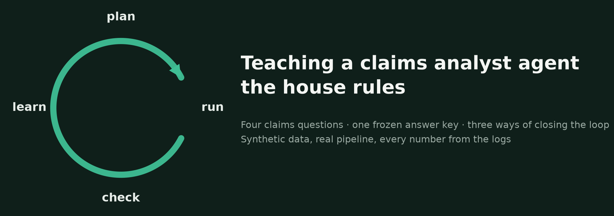
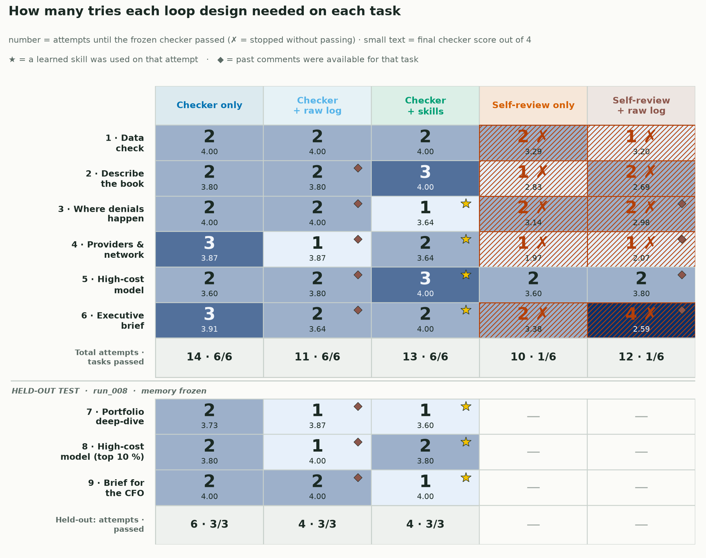
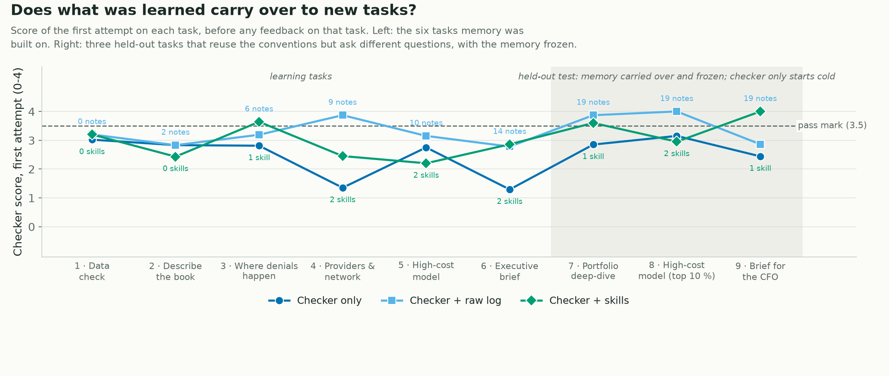

<!--
Title: Loop engineering: five ways to close a self-improvement loop, tried on the same six tasks
Subtitle: A weekend LangGraph experiment on how an agent learns from its mistakes — and why the design of the loop matters more than the model inside it
Tags: Loop Engineering, Agentic AI, LangGraph, Self-Improvement, Evaluation, Synthetic Data
Photo credits:
  - assets/hero.png — "Image by Author" (matplotlib). Swap for an Unsplash photo if you prefer; "spiral staircase" fits the theme.
  - assets/loop_diagram.png — "Image by Author" (matplotlib)
  - assets/results_grid.png — "Image by Author" (matplotlib, from logs/experiment_events.jsonl and logs/skill_events.jsonl, run_006 + run_008)
  - assets/transfer_curve.png — "Image by Author" (matplotlib, first-attempt scores from run_006 and the held-out test run_008)
-->

# Loop engineering: five ways to close a self-improvement loop, tried on the same six tasks

*A weekend LangGraph experiment on how an agent learns from its mistakes — and why the design of the loop matters more than the model inside it*

*Image by Author*

Most agent demos that claim to "get better over time" are really one of two things: a prompt someone kept editing, or a vector store of old chats nobody has measured. I wanted to look at the actual mechanism — the loop. An agent does a piece of analysis, something tells it what went wrong, it tries again, and something is kept for next time. Every word in that sentence is a design choice: *what* tells it, *how much* it is told, *what* is kept, and *who decides* when it is done.

The literature calls the craft of making those choices loop engineering. To try it, I needed a job where an agent can be competent and still wrong in ways that only show up on inspection. Analysing an unfamiliar dataset is exactly that: you pick up its nuances (which rows count, which date means what, which column quietly leaks the answer), you make mistakes you cannot see yourself, and sometimes you simply do not know what to do. I used a synthetic healthcare claims dataset as the example because I know that kind of data; the domain is not the point.

This is a self-learning build. The remarks below are my personal take basis building and running it; no branding, no promotion, and I am not advocating for any framework.

> The model is the least interesting part. The loop is the product.

## What were the tasks?

Six analysis tasks on the same dataset, in a fixed order, phrased the way a sponsor would ask — with none of the conventions spelled out. The right-hand column is what the frozen checker holds and the agent never sees.

| # | The task | What a correct answer looks like |
|---|---|---|
| 1 | **Data check.** Five files arrived. What is in them, can the identifiers be trusted, what period do they cover, do they join? | Row counts of all five tables (members 500 … medical claims 12,845 … pharmacy claims 18,310). Every natural key tested, including the composite key on the adherence table. 36 claims adjudicated before their service ended. Pharmacy claims join to nothing in the provider directory. |
| 2 | **Describe the book.** Volume by status, denial rate, fraud-flag rate, amounts, monthly trend. | Denial rate **1,286 / 12,339 = 10.4 %** over adjudicated claims (506 pended claims excluded; 1,286 / 12,845 is wrong). Monthly trend keyed on when care started, not when the claim was decided. Every rate shown with its denominator. |
| 3 | **Where denials happen.** Top denial codes, claims with no code, denial rate by five segments. | Code shares over *denied* claims. 11,559 claims carry no code, none of them denied. Segments under 30 claims flagged as unstable. |
| 4 | **Providers and network.** Where money and denials go by specialty and network; the ten busiest providers. | Specialty and network reported as separate breakdowns. In-network 10.6 % vs out-of-network 9.7 %. The join to the provider directory verified before it is trusted. Differences described as associations. |
| 5 | **High-cost model.** When a claim arrives, will it end in the most expensive 5 %? | Threshold **$3,198.99 from the training split only**. Billed and allowed amounts are not allowed as features (the target is derived from paid amount). ROC-AUC between 0.60 and 0.95; 0.997 means the answer leaked in. |
| 6 | **Executive brief.** One page for the sponsor, built only from the saved results above. | At most 600 words, the required sections, every number cited to a saved result, no causal wording. |

The right-hand column is a *golden pack*: 112 checks computed by independent reference code, reviewed, and frozen by hash before any agent ran. Score 0 to 4; pass is 3.5 or better with no critical miss. A held-out test later added three tasks, numbered 7 to 9 below, that reuse these conventions but ask different questions; they get their own section.

## How does the loop work?

*Image by Author*

Four steps and a memory:

1. **Plan.** The agent reads the brief and picks a method from a fixed menu per task — which denominator, which date column, which features, which caveats. It does not write code, which keeps the loop safe and every decision comparable.
2. **Run.** Deterministic pandas and scikit-learn code executes the plan and writes the tables, charts and a short report.
3. **Check.** The frozen checker scores the output and sends back the **three biggest problems** — what is wrong, not which setting to change — plus a count of how many more there are.
4. **Reflect and revise.** The agent reads the findings, revises the plan, and the loop runs again. Up to five tries per task.

The memory is the only thing that crosses from one task to the next, and it is the main thing I varied. It is one LangGraph state graph with a SQLite checkpointer; every decision pauses on an `interrupt()` and is answered by a fresh Claude Haiku 4.5 subagent inside my Claude Code session — no API key and, deliberately, no memory of previous steps. If the agent remembered on its own, the "no memory" designs would not be what they claim.

## Which loop designs did I try?

Two questions define a design: *who gives the feedback* (an external checker, or the agent reviewing itself) and *what is kept between tasks* (nothing, a raw log of past findings, or lessons the agent writes as reusable skills). Five combinations ran on the same six tasks, with the same checker scoring every attempt.

| Design | Feedback comes from | Kept between tasks | Where the idea comes from |
|---|---|---|---|
| **Checker only** | the frozen checker, three findings per attempt | nothing | the basic verification loop; "within-rollout refinement" |
| **Checker + raw log** | the checker | every past checker comment, verbatim, shown before planning | a searchable log of past reviewer comments |
| **Checker + skills** | the checker | lessons the agent writes after a pass as Markdown skills, retrieved when they match | skill libraries: Voyager, ExpeL, Reflexion's memory |
| **Self-review only** | the agent critiques its own report; the checker only scores for the record | nothing | Self-Refine (Madaan et al., 2023) |
| **Self-review + raw log** | the agent itself | its own past review notes, verbatim | the cell nobody publishes |

The two "raw log" designs are the cheapest memory imaginable: append the findings after each task, show them all next time, no summarising, no filtering. The skills design is the expensive one: after a pass the agent decides whether a lesson generalises, writes it in a fixed format, a validator checks it is not a duplicate or a one-off, and it is retrieved later only when its trigger matches.

## How did they do?

*Image by Author*

| Design | Attempts to pass 6 tasks | Failed checks on first tries | Tasks the checker passed |
|---|---|---|---|
| Checker only | 14 | 39 | 6 / 6 |
| Checker + raw log | 11 | 20 | 6 / 6 |
| Checker + skills | 13 | 28 | 6 / 6 |
| Self-review only | 10, stopped by its own verdict | 29 | **1 / 6** |
| Self-review + raw log | 12, stopped by its own verdict | 39 | **1 / 6** |

Five things I read off the top block of that grid (the bottom block is the held-out test, further down).

**The loop iterates.** With three findings at a time and no fix attached, the checker-only design needed two or three tries on every task. Task 4 went 1.35 → 3.11 → 3.87: the first plan lumped specialty and network into one breakdown, the checker said so, the second plan fixed that and exposed the next layer. That staircase is what a verification loop is supposed to look like.

**A raw log of past comments was the best memory here.** Eleven attempts instead of fourteen, and half the first-try failures. On task 4 it passed first time with nine past comments in front of it — several of them about denominators and small segments from tasks 2 and 3, which is exactly what task 4 needed. Nothing clever happened: the agent read what a reviewer had said before and did not repeat the mistake.

**Skills helped where a lesson applied, and cost more to earn.** The agent wrote two skills — "include the synthetic-data caveat in reports" after task 1 and "denial-rate denominator standardisation" after task 2 — and cited them on all four later tasks. Task 3 passed first time with the denominator skill. But writing, validating and revising skills took 31 operator steps against 16 for the raw log, and two of the six tasks still needed three tries. Distillation is not free, and a library of two lessons cannot cover much.

**Self-review is not a checker.** Both self-review designs declared every task done; the checker passed one of six each time, and it was the same task in both: the model, where the agent's own review happened to spot the leaked features and the threshold computed on the wrong rows. On the executive brief the self-review design did something instructive: its first attempt had actually passed at 3.64, it asked itself for a revision anyway, and the revision failed at 3.38. Without an external reference the loop cannot tell improvement from drift.

**Giving the self-reviewer a memory made it worse, or at best no better.** Thirty-nine first-try failures against twenty-nine. A log of your own past notes is a log of your own blind spots.

And the caveat that applies to all of it: one run, a model that is not deterministic. On task 1, before any memory existed, the three checker designs started at 3.02, 3.20 and 3.20. Part of every gap is the luck of the first plan. The direction of the results is credible; the size is not.

## Does what was learned carry over?

The six tasks above are where the memory was built, so they cannot show whether it transfers. For that I ran a held-out test. Think of two employees given the same three pieces of work: a new joiner who has never seen this data, and a colleague who has been corrected on it for months. The new joiner is the checker-only design, starting cold. The colleague is each memory design, carrying exactly what it held at the end of task 6 — the raw log's nineteen notes, or the two skills — with the memory **frozen** for the test: nothing appended, no new skills, so what you see is carry-over and nothing else.

The three tasks are deliberately dense in the conventions the learning tasks taught, and they ask different questions: a fuller description of the book (status mix, denial rate, fraud flag, how the amounts are distributed, monthly volume and spend); an early-warning model for the most expensive 10 % of claims instead of 5 %; and a one-page brief for the CFO built from those two results. On catalogue defaults these tasks score between 1.2 and 1.7; with the conventions applied they score 4.0, so there is room for experience to show. To make sure no answers travelled with the memory, every number in the seeded notes was replaced by a placeholder, and an audit compared what remained against every value in the new answer keys. It caught one: the adjudicated-claims denominator count from task 2, which the book question would have reused.

*Image by Author*

| Held-out tasks 7 to 9 | New joiner: checker only | Colleague: checker + raw log | Colleague: checker + skills |
|---|---|---|---|
| Passed on the first attempt | 0 of 3 | 2 of 3 | 2 of 3 |
| Attempts to pass all three | 6 | 4 | 4 |
| Failed checks on first tries | 14 | 3 | 8 |
| Mean first-attempt score | 2.81 | 3.58 | 3.52 |

The new joiner made the classic mistakes on every task: the wrong denial-rate denominator and the wrong month on the book, leaked amount fields and an implausible AUC on the model, causal wording and missing sections on the brief. The raw-log colleague made almost none of them — one missing caveat on the book, a clean first pass on the model — and one genuinely new mistake on the brief: causal wording, which no note in its log had ever mentioned, because in the learning run it had been corrected on citations and sources, not on wording. The skills colleague applied its denominator lesson on the book and its caveat lesson on the brief, and had nothing in its two skills about the model's leakage rule, so it failed that once, like the new joiner.

That is the honest shape of the result, and it holds in both directions: **memory transfers conventions, not competence.** A design remembers the corrections it has received and stops repeating them; it cannot pre-empt a convention it has never been corrected on, and it should not be expected to. A first held-out set I built before this one had tasks a cold start could nearly pass anyway, and showed only a sliver of a gap; it is archived with its numbers, because a test set has to be hard enough for experience to matter.

## What I take from it

- **Put the evaluator outside the loop.** The cheapest design to build is the one that produces confident, wrong work. If the thing being improved also decides when it is good enough, you have a demo, not a control.
- **Feedback that names problems, not fixes, is what makes learning visible.** An earlier version of this experiment handed back the full checklist with fixes attached; everything converged in one retry and taught the loop nothing a good error message would not.
- **Start with the dumb memory.** A raw log of past findings beat self-written skills on the six learning tasks and edged them on the held-out test. Skills are the right long-term structure — a log of thirty comments is already at its cap, and retrieval by trigger scales where "show everything" does not — but the distillation step has to pay for itself, and here it did not yet.
- **Judge memory by what it stops you repeating.** On the held-out tasks the memory designs did not know more; they made fewer of the mistakes they had already been corrected on. That is the right expectation to set, and the right thing to measure: first-attempt failures on conventions seen before, not overall score.

## Food for thought

> **Who writes the checker?** In this experiment the same person wrote the rubric and blinded the briefs — me. In practice the checker encodes whoever's conventions won the last argument. That is not a flaw of the loop; it is the loop making an implicit standard explicit, which is uncomfortable and useful in equal measure.

> **When does memory stop being an asset?** Two skills are a notebook; a raw log capped at thirty notes is already choosing what to forget. Which lessons to keep, merge or retire is a governance question, and I have not seen a clean answer.

## Learnings and next steps

- The feedback regime is a design parameter, not plumbing. Three findings, fix withheld, five attempts — those numbers decide whether you see a loop or a lookup.
- Blinding matters more than model size. A stronger model reading briefs that stated the conventions passed everything first time and learned nothing; a small model with blinded briefs produced all of the behaviour above.
- One run per design, plus one held-out run, is a demonstration, not evidence. Next: several seeds per design, a longer task sequence so skills have more to earn, and a retirement rule for memory that stops being cited.
- Synthetic data throughout. Nothing here says anything about any real payer, provider or member; it says something about how to build the loop.

## References

1. Madaan et al., *Self-Refine: Iterative Refinement with Self-Feedback* (2023) — https://arxiv.org/abs/2303.17651
2. Shinn et al., *Reflexion: Language Agents with Verbal Reinforcement Learning* (2023) — https://arxiv.org/abs/2303.11366
3. Wang et al., *Voyager: An Open-Ended Embodied Agent with Large Language Models* (2023) — https://arxiv.org/abs/2305.16291
4. Zhao et al., *ExpeL: LLM Agents Are Experiential Learners* (2023) — https://arxiv.org/abs/2308.10144
5. LangChain, *The Art of Loop Engineering* — https://www.langchain.com/blog/the-art-of-loop-engineering
6. Lilian Weng, *Harness Engineering for Self-Improvement* (2026) — https://lilianweng.github.io/posts/2026-07-04-harness/
7. LangGraph documentation, human-in-the-loop interrupts and checkpointers — https://docs.langchain.com/oss/python/langgraph/overview
8. HLT-008 Synthetic Healthcare Claims Dataset (sample), `xpertsystems/hlt008-sample` on Hugging Face, CC BY-NC 4.0 — https://huggingface.co/datasets/xpertsystems/hlt008-sample

The code, the frozen golden packs, all 134 operator requests and responses across the learning run and the held-out test, the memory logs with their redaction audit, the learned skills and the logs the figures are drawn from are in the `claims-skill-loop` repository (branch `feat/claims-skill-loop`, runs `run_006` and `run_008`; the superseded first held-out attempt is `run_007` in the archive). This article is also online at https://claude.ai/code/artifact/541293ef-bde3-4a40-95ff-11449a825aee.
