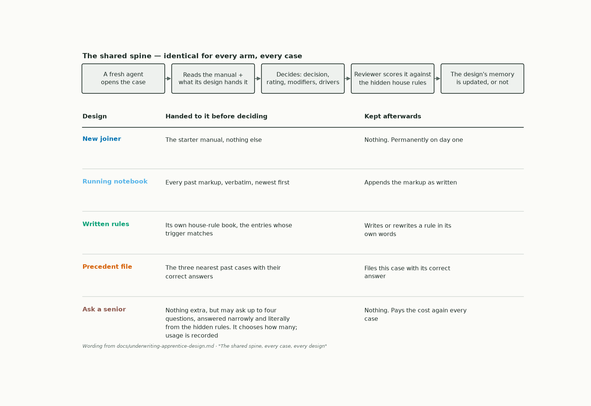
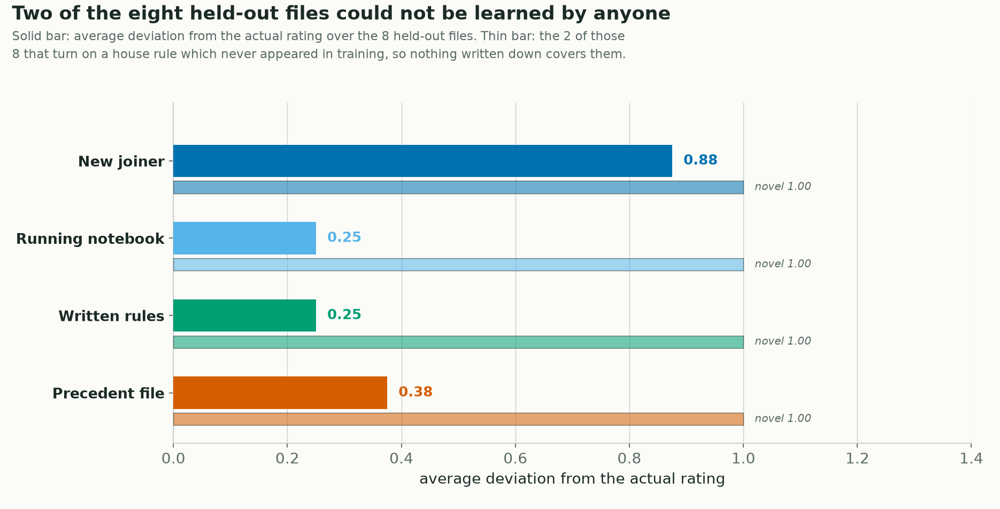

<!--
Title: Loop engineering: the underwriting apprentice, four ways to make an agent learn on the job
Subtitle: A LangGraph experiment. One life insurance application rated thirty-eight times, and what each design actually kept.
Tags: Loop Engineering, Agentic AI, LangGraph, Memory, Underwriting, Insurance
Photo credits:
  - assets/what_each_gets.png, "Image by Author" (matplotlib)
  - assets/learning_curve.png, "Image by Author" (matplotlib, from artifacts/uw/uw_001/<arm>/cases.jsonl)
  - assets/holdout.png, "Image by Author" (matplotlib, from artifacts/uw/uw_001/<arm>/cases.jsonl)
  - A stock hero photo (Unsplash: a desk of paper files, or a stack of forms) can be dropped in above the title.
-->

# Loop engineering: the underwriting apprentice, four ways to make an agent learn on the job

*A LangGraph experiment. One life insurance application rated thirty-eight times, and what each design actually kept.*

Every agent framework now advertises that its agents "learn from experience". Push on that claim and it usually turns out to be one of two things: a prompt somebody kept editing by hand, or a vector store of old conversations that nobody has ever measured. Neither is learning in the sense a manager means it. A manager means the new person makes a mistake in week one, and by week six they don't make it any more.

So this article is not really about insurance. It is about the **loop** you build around an agent. Who tells it that it was wrong, what it is allowed to keep afterwards, and what it gets handed the next time a similar job lands. Those choices are the product. People have started calling the discipline loop engineering, and the honest way to test it is to build several loops that differ in exactly one thing each, then push the same work through all of them and see which one accumulates anything.

The remarks below are my personal take basis building and testing this over a couple of weekends. There is no branding or promotion here, and the data is entirely synthetic. No real applicants, no real carrier's manual.

## Why an underwriting desk?

The hard part of testing this is choosing the work. A learning curve needs **the same job, done again and again, by someone who is getting corrected.** Six different tasks would give you six one-shot trials rather than a curve, however interesting each one is on its own.

That is an apprenticeship, and individual life underwriting is close to a perfect laboratory version of one. A new underwriter is hired and given only a manual to decide from. There is no prior experience. Files arrive one at a time, and a senior marks up each one.

The manual is not the job. The job is the manual, plus the house practice that nobody ever wrote down.

## What the underwriter is given

Two things, and one worked example will carry the rest of this article.

**The file.** About fifteen structured fields, roughly a page. This is the sixth of the thirty-eight, shortened a little:

```text
Applicant:      M, age 37
Product:        30-year term, face $750,000
Build:          6'2", 206 lb, BMI 26.4; weight stable
Tobacco:        quit more than 5 years ago; nicotine screen negative
Blood pressure: 121/76, untreated
Lipids:         total cholesterol 204, HDL 47, ratio 4.3
A1c:            5.7; no diabetes diagnosis
Occupation:     office administrator, class A
Driving:        0 moving violations in 3 years; DUI conviction 2024
Sleep apnea:    diagnosed, no CPAP in use
Financial:      income $175,000, $400,000 already in force
Also on file:   collects first-edition crime novels
```

Every file carries one detail that does not matter, because knowing what to ignore is part of the job.

**The manual.** The same one for everybody, about 900 words and roughly thirty-five rules, and every number is in it. A straightforward file can be rated exactly right from the manual alone. Four lines out of the thirty-five, the ones this file touches:

> **Build.** Read the BMI: up to 18.9, charge 25. 19.0 to 27.9, charge nothing. 28.0 to 30.9, charge 25.
>
> **Driving record.** Moving violations in the last 3 years: 0 to 1, nothing. 2, charge 25. 3 or more, charge 50. A DUI conviction: rate 50.
>
> **Sleep apnea.** Diagnosed sleep apnea, charge 50.
>
> **Classes.** Add the charges and read the class off the total: 0 to 49 Standard, 50 to 99 Table 2, 100 to 149 Table 4, 150 to 199 Table 6.

Work the file with only that and the answer is clean. Fifty for the DUI, fifty for the untreated apnea, one hundred in total, which reads off as **Table 4, accept**. All four designs gave exactly that answer on this file.

## The answer, and the reason

```text
Decision:  postpone
Rating:    none
Reason:    a recent DUI is postponed, not rated. The file goes back for the
           conviction to age and for the record around it. The sleep apnea is
           charged underneath but does not decide the file.
```

Table 4 is a defensible reading of the manual, and it is wrong. The house practice is that a recent conviction is not something you price, it is something you wait out. That rule appears nowhere in the manual. It is one of fourteen like it, frozen before anything started and never shown to anyone. Twelve of them turn up in the training files. The other two are held back, and they matter later.

The manual is honest about where it stops, the way real manuals are. Underneath the driving table it says *"For a recent motoring conviction, refer to underwriting judgement."* That tells you a gap exists. It does not tell you what fills it.

The rest are the same shape. A treated and controlled blood pressure carries the treatment charge only, not the reading on top. Family history charges lapse once the applicant is over 60. Where the cholesterol band and the ratio band disagree, the ratio governs. A large face amount at a high multiple of income is postponed for financial evidence rather than rated. Each one is discrete, so it is learnable from a single correction, and each fires in at least three training files in at least two different shapes, so nobody can learn it too narrowly and still pass.

## How each design is scored

One number, for everybody, on every file: **the average deviation from the actual rating.** Everything later in this article is measured in it, so it is worth thirty seconds.

Rating classes sit in a fixed order, best to worst:

```text
Preferred Plus · Preferred · Standard Plus · Standard · Table 2 · Table 4 · Table 6 · Table 8 · Decline
```

The table numbers are insurance shorthand for extra mortality above standard, conventionally about twenty five percent per table, so Table 4 is an applicant priced at roughly twice standard risk. This experiment never prices anything. It only counts how many positions apart two answers are.

The deviation on a file is how many positions apart the agent's answer and the actual answer are. If the actual answer is Table 2 and the agent says Table 4, that is one position, so the deviation is 1. Say Table 6 and it is 2. Say Table 2 and it is 0, an exact match.

A postpone is not a rating at all, so it sits off that list. When one side postpones and the other puts a price on the file, that counts as a flat 2. **So every design scored 2 on the file above**, because each of them rated at Table 4 what should have gone back unrated.

Average that over the files and you have the score. **Lower is better, and zero means the rating matched exactly.** The number coming down over time is the thing this whole experiment is looking for.

I score the class rather than the arithmetic that produced it, on purpose. The class is what the applicant actually pays. Two underwriters can reach the same class by slightly different routes and both be right, and an agent that keeps the charges tidy but lands the applicant one class too expensive has still done the job badly.

Thirty training files with a marked-up correction after each, then eight held-out files with memory frozen and no markup at all. Constant difficulty from file one. No gentle opening, because a gentle opening would make every line rise as the mix normalised, which is the opposite of the shape we are looking for.

## Four ways to close the loop


*Image by Author*

Underneath, all four are the same LangGraph state graph with a SQLite checkpointer. Every decision is answered by a **fresh model instance with no conversation history**. If the model remembered on its own, "new joiner" would mean nothing.

| The design | What they have when they open the file | What they keep when the file is done |
|---|---|---|
| **New joiner** | The manual, and nothing else | Nothing. Every file is day one again |
| **Running notebook** | The manual, plus every comment the senior has ever written, word for word | Pastes the senior's comment into the notebook exactly as written |
| **Written rules** | The manual, plus a rule book they have written themselves | Turns the new correction into a rule in their own words and rewrites the book |
| **Precedent file** | The manual, plus the three most similar past files and how each was rated | Files this case away with its correct answer |

The clearest way to think about the middle two is as **two different documents in an office**.

The **running notebook** is the team's shared record. It is the manual being extended as you go: every correction the senior writes is appended, nothing is interpreted, and anyone who walks in can pick it up and read it. It is institutional memory, and it costs nothing to maintain because no thinking is done to it.

The **written rules** book is one underwriter's own reflections. After every file they reread their whole book alongside the new correction and rewrite it in their own words, in the form *when this applies, do this, and here is why*. That is what specialisation looks like, and it costs a second model call every single file.

### What actually happens on one file

Every one of the thirty-eight files runs the same five steps, and the deciding step is a language model:

```text
fresh model instance, no history
    -> handed the case file, the manual, and whatever its own design gives it
    -> reads them and decides: decision, rating class, any modifiers, the factors it charged for
    -> returns that as JSON
    -> deterministic code scores it against the frozen answer and writes the senior's markup
    -> the design's memory is updated, or it is not
    -> the instance is discarded
```

Nothing carries over except the memory. The next file starts a new instance that has never seen any of this, which is why the only thing separating the four designs is what their memory hands them at step two. The scoring, the markup and the memory updates are all ordinary code, so the model is never asked to mark its own work.

The **precedent file** is the third instinct, which is to not generalise at all and just find the closest previous case. It matches on attributes rather than meaning, using a weighted distance over age band, build, tobacco, each lab band, occupation class, avocation, driving record and the face-to-income multiple. Deterministic, explainable, and roughly how an underwriter actually searches.

## What happened over thirty-eight files


*Image by Author*

This is the whole experiment in one picture. Each line is the running average deviation from the actual rating, over every file done so far. It answers the question a manager actually asks: across everything this person has touched, how good have they been?

For the first seven files all four lines sit exactly on top of one another, which is why you only see one. Four things worth pulling out of that:

- **At the start, the four designs are the same thing.** Each has the manual and nothing else that helps yet. Same information in, same answers out.
- **That is a bug check, not a result.** If one design could see another's notes, or I had wired the memory wrong, they would have split apart straight away. I wrote it down before running anything: the first three files must match, or the whole thing is void. They matched.
- **The agreement then held for four more files on its own.** I did not predict that, and the reason is simple. Memory only helps the second time you meet a rule. Every hidden rule in that stretch was firing for the first time. The note-takers did have notes by file four. None of them applied yet.
- **The DUI file from earlier is file six**, inside that stretch. That is why all four rated it the same way and all four were two positions off.

A second check was registered the same way, and it is a separate thing. On straightforward files, the ones the manual fully answers, experience should change nothing. A book that already has the answer does not get better with practice. It stayed at zero for all four designs, first file to last.

From file eight they fan out, and they never come back together.

| Design | Average deviation, 30 training files | Files rated exactly right | Decision correct |
|---|---|---|---|
| New joiner | 0.67 | 15 of 30 | 71% |
| Running notebook | 0.40 | 21 of 30 | 89% |
| Written rules | 0.33 | 23 of 30 | 89% |
| Precedent file | 0.47 | 20 of 30 | 84% |

*Decision correct means accept, accept with modification, postpone or decline matched exactly, across all 38 files.*

The new joiner's line is the control, and it is the one place I have to be careful, because it does not stay flat. Over the first fifteen training files it averages 0.87, and over the last fifteen it averages 0.47. Difficulty is constant by design, so the case mix does not explain that. My best reading is that several of these house rules are real industry practice rather than pure invention, so a capable model recovers some of them from what it already knows, and how often that helps varies with which files happen to need them.

The held-out files settle the question the training line cannot. There, the new joiner's errors are identical, file for file, to what a careful literal reader of the manual alone produces. Thirty files of corrections had passed through the same office, and not one of them left a mark, because there was nowhere for a mark to land.

The three memory designs pull away and then **flatten out around file 25**. That flattening is not a stall, and it is worth being clear about why. Deviation cannot go below zero, the straightforward files were never going to be wrong, and by file 25 each design has been corrected on most of the twelve rules at least once. There is simply less left to learn. Where a line settles is the interesting number, not whether it is still falling.

## The held-out test

The shaded region on the right is where it gets interesting. Eight fresh files, memory frozen, nothing appended and no rules rewritten. One attempt each, no markup, no second chance. The new joiner sits this one as herself, because an agent that keeps nothing is a new joiner by construction.

Watch what the running average does when the feedback stops. The new joiner's line **turns upward**, from 0.67 to 0.71. The other three keep falling. That is the finding in one gesture: the designs that kept something walk into unseen work and do better than their own track record, and the one that kept nothing does worse.


*Image by Author*

| Design | Rated exactly right | Average deviation |
|---|---|---|
| New joiner | 2 of 8 | 0.88 |
| Running notebook | 6 of 8 | 0.25 |
| Written rules | 6 of 8 | 0.25 |
| Precedent file | 5 of 8 | 0.38 |

The new joiner's 0.88 is almost exactly the 0.88 that a careful, literal reader of the manual alone scores on the same eight files. Thirty files of experience existed in that office and she had access to none of it. That is the honest price of house practice nobody writes down: roughly two thirds of a class per file, forever.

## The two files nobody could get right

Look at where the dashed line sits on that chart, at six rather than eight.

Two of the eight held-out files were built to be unlearnable. Each turns on a house rule that **never appears in any of the thirty training files**. No correction was ever given on it, nothing in the manual covers it, and no amount of rereading a notebook or rewriting a rule book can produce it. There is simply no path from anything the agent has ever been shown to the right answer.

All four missed both, which puts the highest possible score at six rather than eight. Read the chart again with that in mind and it says something sharper than it first appears: the notebook and the rule book did not merely do well, they got **every file that could be got right**, and the only two they dropped were the two that no amount of note-taking could reach. The precedent file dropped one it could have had. The new joiner dropped four.

That is not a failure of the memory designs. It is the ceiling, and it is the most portable lesson here.

A learning loop can only ever capture what its feedback has actually covered. If the work your agent sees during training does not contain a situation, then no memory design, no retrieval strategy and no amount of reflection will produce the right answer when that situation finally turns up in production. **The coverage of your examples is the binding constraint, not the cleverness of your memory.** Teams reach for a better retrieval layer when what they actually need is a more comprehensive and representative set of cases with corrections attached.

The encouraging half of the same point is that this is a fixable constraint rather than a fundamental one. Feed the loop more files, and in particular more of the awkward edge cases, and those two would stop being unlearnable: the rule behind each would fire in training, get corrected once, and join the notebook like any other. Keep going and the curve should keep falling toward zero, then plateau at whatever the model's own careless reading costs, which is the floor no amount of memory can remove. My thirty files exhausted twelve rules. A real desk has hundreds, and would need a correspondingly bigger and more varied set of cases before the line settled.

## What actually got written down

The abstract claim is that memory carries house practice. Here is what that looks like in the files themselves, on the same DUI file from earlier.

**A page from the running notebook.** This is the senior's comment, pasted in exactly as written, and it is the whole of what the notebook keeps:

> UW-T06: This one needed postponing rather than rating. On review the file should have been postponed. The material factors are DUI and sleep apnea. A recent DUI is postponed, not rated.

Nothing is added and nothing is interpreted. Note what is absent: no threshold, no number, no "within N years". The senior states practice, never a parameter. Whoever reads this later has to work out for themselves how recent counts as recent.

**An entry from the written rules book.** The other design took the same correction and turned it into its own rule, which after thirty files reads:

> **2. DUI.** *When it applies:* a DUI conviction appears on the file.
>
> *Within two years of the application, postpone.* Settled at one year and at two. Decision postpone, class null, modifiers empty. Then finish the file and name 'DUI'.
>
> *Older than two years:* charge the manual's rate and say judgement was used on recency. Three years is untested: lean recent, postpone, and say judgement was used, because both corrections on this line were for accepting too soon.

That is exactly what you would want a junior to write. The real house rule is three years, and the book settled on two, because two is all it had ever been shown. What I find genuinely impressive is the last sentence. It knows the difference between what it was taught and what it inferred, it says which way to lean when it is outside its evidence, and it explains why. The finished book ran to about 48,000 characters across twenty entries, each one citing the files that taught it.

## Food for thought

> **Is a shared notebook as good as a specialist?** This is the question I would most like a reader to argue with me about. If a new joiner can walk in, pick up the team's updated notes and match the underwriter who spent thirty files writing their own, then specialisation buys nothing and only the shared record matters. Over the training files, where both ran on the same model, the personal rule book was modestly ahead. On the held-out files the two scored the same, but I would not lean on that: the rule book took that test on a stronger model than the notebook did, for a reason I explain in the repository, so the tie is not a clean one. I would not call that settled either way, and the honest reading is that the shared notebook gets you most of the distance for a fraction of the effort.

> **In this setup, nothing lives in the person.** That is worth saying plainly, because it bounds what the experiment can claim. Every file is decided by a fresh model instance with no memory of anything, so all of the experience has to live in a document. What is being compared is therefore which document carries experience best, not whether an experienced person beats a newcomer holding their notes. For anyone building agent systems that is the more useful comparison anyway, since your agents are stateless too.

> **Cheap memory did almost as well as clever memory.** The notebook does nothing smarter than paste every past comment in reverse order. The rule book needed a second model call after every single file, 68 calls against the notebook's 38. Over a longer stretch the notebook's context will eventually burst and the rule book's will not, so a crossover exists. At thirty files it has not arrived. Before you build a summarisation and retrieval layer, check whether pasting the raw log gets you most of the way.

> **Precedent was the weakest of the three memories.** It carries answers, not rules. A near-identical past file helps enormously, and a merely similar one quietly misleads, which is why it finished behind both note-takers despite holding the richest thing of the three.

> **The gap that matters is not between the memory designs.** It is between having one and not. The running notebook scored 0.25 on unseen work against the new joiner's 0.88, on the same model, the same manual and the same eight files. Everything else here is a rounding error next to that.

## Learnings and future enhancement areas

- **One job repeated is the whole design.** Six different tasks cannot produce a learning curve, however interesting each one is. If you are evaluating whether an agent improves, the first question is not which memory you use, it is whether your test set repeats.
- **Coverage beats cleverness.** The single highest-value thing I could add is not a better memory, it is more files covering more awkward situations, each with a correction attached. That is what moves the curve toward zero, and it is the part teams most often skip.
- **Write down in advance what would void the results.** The dead heat over the first three files, and flat performance on straightforward files, were both recorded before any code was written. Had either failed, the honest finding would have been "something leaked", and this article would have said so.
- **A fifth design did not make the cut, and the reason is instructive.** I also built an *ask a senior* design, which keeps no memory but may ask up to four questions before deciding. It scored a perfect zero on all thirty-eight files, which tells you about my senior rather than about the design. I had implemented the senior as a lookup that always knew the right answer, so it was an oracle, not a colleague. A real senior is an experienced average: the manual, somewhat more practice, and their own blind spots. Modelling that properly is a better experiment than the one I did, and it is the first thing I would add.
- **Each design did this once, so this is not a benchmark.** No error bars, and the held-out contrast is thinner than eight files makes it sound. Two of the eight are straightforward and every design got them right. Two are the unlearnable ones and every design got them wrong. Four files carry the whole separation. The ordering is the finding, the exact decimals are not, and repeating each design five times is the first thing I would spend more compute on.
- **The manual is mine, so this measures learning a house style**, not learning underwriting. A real carrier's manual and real markups from a real senior would be a genuinely different and much harder test.
- **What I would build next:** a retirement rule for memory, since nothing here ever forgets and a wrong early lesson would persist indefinitely. A cost-weighted score, so a Table 2 written as Table 4 is not penalised the same as a decline written as an accept. And a design that keeps a rule book and may also ask when the book is silent, which on this evidence is what an actual apprentice does.

## References

1. Madaan et al., *Self-Refine: Iterative Refinement with Self-Feedback* (2023), the self-review loop.
2. Shinn et al., *Reflexion: Language Agents with Verbal Reinforcement Learning* (2023), verbal feedback as memory.
3. Wang et al., *Voyager: An Open-Ended Embodied Agent with Large Language Models* (2023), the growing skill library.
4. Zhao et al., *ExpeL: LLM Agents Are Experiential Learners* (2023), insights extracted from past trials.
5. LangGraph documentation, `interrupt()` / `Command(resume=)` and checkpointers: https://langchain-ai.github.io/langgraph/

*Every number in this article comes from the per-file logs in `artifacts/uw/uw_001/<design>/cases.jsonl` and is reproduced by `scripts/summarize_uw_run.py`. The files, answers, manual and house rules are frozen by hash beforehand. The full manual, the complete rule list and the method notes are in the repo.*
